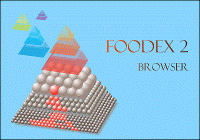

# Catalogue browser
The catalogue browser is a Java-based application that allows the use and reading of the catalogues released by EFSA in the Data Collection Framework. More specifically, the application allows the user to download one or more catalogues of interest from those available on the DCF and then be able to consult the data within it using the graphical interface. In addition, the tool allows also the encoding of terms, present within the database, in alphanumeric codes to which facets (descriptive terms) can be concatenated.

    
    

# Dependencies
The project needs the following projects to work properly:
* https://github.com/openefsa/CatalogueXmlToXlsx
* https://github.com/openefsa/Dcf-webservice-framework
* https://github.com/openefsa/http-manager
* https://github.com/openefsa/http-manager-gui
* https://github.com/openefsa/java-exception-to-string
* https://github.com/openefsa/Open-xml-reader
* https://github.com/openefsa/Progress-bar
* https://github.com/openefsa/sql-script-executor
* https://github.com/openefsa/version-manager
* https://github.com/openefsa/java-swt-window-size-save-and-restore
* https://github.com/openefsa/zip-manager

## Import the project in Eclipse IDE
In order to import the Catalogue browser project correctly into the Eclipse development environment, it is necessary to download the Catalogue browser together with all its dependencies. Next, in order to allow an easy import into the IDE, extract all the zip packets inside the eclipse workspace. 
At this stage you can simply open the IDE and and import all the projects just extracted one by one.

_Note that the Catalogue browser and its dependencies make use of the Maven technology which automatically download and set up all the jar files useful for the proper functioning of the tool._

The only projects which require to manually configure a library into the build path are the **Catalogue browser** and the **HttpManager GUI** projects which are making use of the **Jface** jar file downloadable from the following [link](http://www.java2s.com/Code/JarDownload/org.eclipse/org.eclipse.jface-3.8.jar.zip).

For further information on how to use the tool and how to correctly install it in your local computer refer to the wiki page.

### Notes for developers
Do NOT change the business_rules package name, since the Batch checking tool uses it to make the checks.

